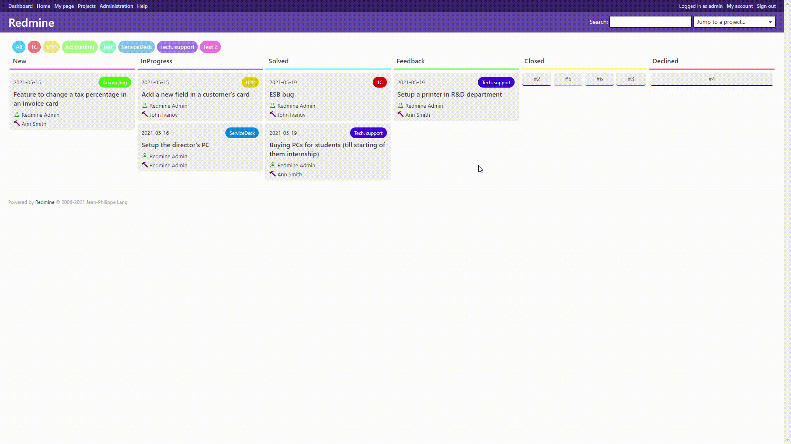
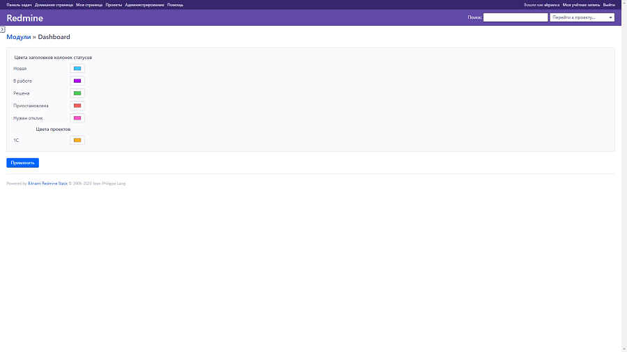

# Dashboard 

Plugin adds a new item to the top menu and is presented as a dashboard that contains issues and their statuses in columns.  
Available a moving of issue cards between statuses, going to the issue by clicking on the issue card, changing statuses and projects colors.  

#### Supported languages:
- Russian
- English
- Polish (thanks Wojtek Śmiałek)

### Features:  
- Displaying tasks of child projects (configurable)
- Custom coloring of projects and tasks badges
- "Drag-And-Drop" tasks between statuses
- Displaying of "closed" statuses and issues (configurable)
- Minimizing of "closed" issue cards (configurable)

### Installation:  
Just follow Redmine plugin installation steps (it doesn't require migration step)

### Notes: 
*if you want to change Redmine root page to this dashboard, you should replace string*
```ruby
root :to => 'welcome#index', :as => 'home'
```
*in Redmine default config file by path "config/routes.rb" to*
```ruby
root :to => 'dashboard#index', :as => 'home'
```



