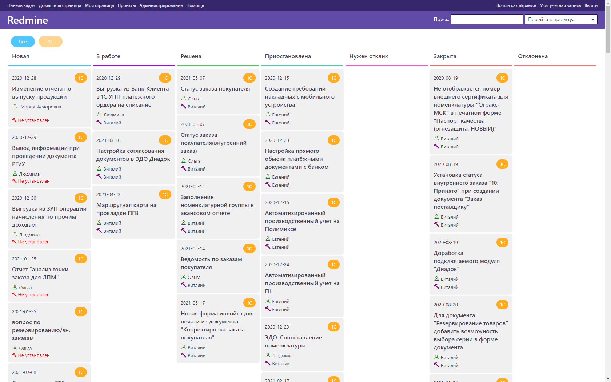
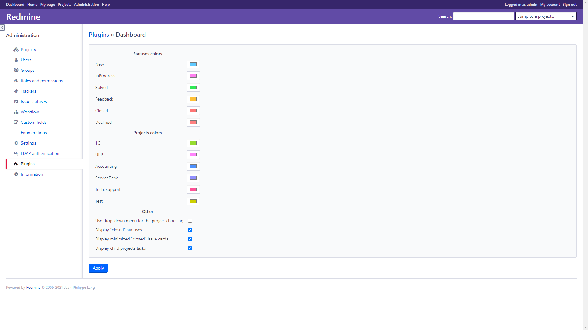

# Dashboard 

Plugin adds an issues dashboard to the application.
This dashboard looks like an usual Kanban desk and presents a column for each status that contains issue cards.
You can follow to any issue just by clicking on the issue card. Also it adds a new item to the top menu.  

You can adapt the plugin in settings by changing projects and statuses colors that will be displayed on the dashboard page

### Installation:  
Just follow Redmine plugin installation steps (it doesn't require migration step)

### Configuration:
This plugin provides some options to custom displaying of the dashboard:
1. Enable/disable displaying of "closed" statuses and issues  
2. Enable/disable minimizing of "closed" issues (if they are enabled)
3. Colors of statuses and projects

### Notes: 
*if you want to change Redmine root page to this dashboard, you should replace string*
```ruby
root :to => 'welcome#index', :as => 'home'
```
*at Redmine default config file by path "config/routes.rb" to*
```ruby
root :to => 'dashboard#index', :as => 'home'
```



<<<<<<< HEAD
=======

>>>>>>> master
